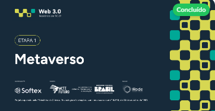

# METAVERSO

Código criado para utilização junto ao curso de imersaoRA

<p align="center"></p>

## Repertório para os Desafios de Projeto das Unidades


# AMIA — Assistência e Manutenção Inteligente e Aumentada da ISS

## Sobre o Projeto

Este projeto propõe uma arquitetura inovadora e de alto impacto para a **manutenção preditiva e assistida na Estação Espacial Internacional (ISS)**. A solução, denominada **AMIA (Assistência e Manutenção Inteligente e Aumentada)**, combina o poder da Inteligência Artificial (IA) para a previsão de falhas com a imersão da Realidade Aumentada (RA) para a execução precisa de procedimentos de manutenção.

---

## Objetivo Principal

Criar um **ambiente espacial interativo e imersivo** para treinamento de procedimentos de manutenção da ISS, simulando:

- O sistema solar com o Sol, planetas e suas órbitas
- A Estação Espacial Internacional orbitando a Terra
- O interior da ISS em primeira pessoa, com equipamentos e janelas com visão do espaço

O ambiente foi desenvolvido no **Unity 6.3 LTS** com o pipeline de renderização **URP (Universal Render Pipeline)**.

---

## Ambiente Desenvolvido

### 1. Sistema Solar (Cena Externa)

O sistema solar foi construído com proporções visuais equilibradas, permitindo visualizar todos os planetas ao mesmo tempo. Os principais elementos implementados foram:

#### Sol
- Criado como uma **Sphere 3D** com material baseado em **Shader Graph customizado**
- Propriedades do shader: `BaseColor`, `CellDensity`, `SolarFlare`, `CellColor`, `CellSpeed`
- Efeito procedural animado simulando a superfície solar sem necessidade de textura
- **Point Light** filho do Sol para iluminar os planetas
- **Bloom** configurado via Post-Processing (Volume + URP)

#### Planetas
Alguns dos planetas foram criados como **Sphere 3D** e outros em 2d com materiais `Universal Render Pipeline/Lit` e texturas aplicadas no **Base Map**:

| Planeta | Scale | Position X | Rotation Z (Órbita) |
|---------|-------|------------|----------------------|
| Sol | 10 | 0 | 0 |
| Mercúrio | 0.5 | 20 | 7° |
| Vênus | 1.2 | 32 | 3.4° |
| Terra | 1.3 | 45 | 0° |
| Lua | 0.35 | 3* | 5.1° |
| Marte | 0.7 | 60 | 1.9° |
| Júpiter | 4.0 | 100 | 1.3° |
| Saturno | 3.5 | 145 | 2.5° |
| Urano | 2.2 | 185 | 0.8° |
| Netuno | 2.1 | 220 | 1.8° |

*Posição relativa à Terra

#### Hierarquia da Cena
```
SolarSystem
├── EnDsTrail
├── Main Camera
├── Global Volume
└── Sistema Solar
    ├── Sol
    │   └── Point Light
    ├── Mercurio
    │   └── Axis
    ├── Venus
    │   └── Axis
    ├── Terra
    │   ├── Moon
    │   │   └── Axis
    │   ├── Space Station (ISS)
    │   └── Axis
    ├── Marte
    ├── Júpiter
    ├── Saturno
    ├── Urano
    └── Netuno
```
<p align="center"></p>
[Sistema solar 3D](https://assetstore.unity.com/packages/3d/environments/planets-of-the-solar-system-3d-90219)
---

### 2. Estação Espacial Internacional (ISS)

- Modelo 3D importado como Prefab (`Space Station.prefab`) do pacote **Cobble Games Spaceship**
- Posicionada como **filha da Terra** para orbitar junto com ela
- Materiais corrigidos de HDRP para **URP/Lit**
- Scripts de **Rotação** e **Translação** aplicados

**Configuração:**
```
Position: X: 8, Y: 2, Z: 0
Scale:     X: 0.02, Y: 0.02, Z: 0.02
```

---

### 3. Ambiente Interior da ISS (Cena Interna)

- Construído com o asset **Modular Sci-Fi Corridor** (24 prefabs modulares)
- Cena **Demo 1.0 Free** utilizada como base
- Materiais convertidos de Built-in para **URP/Lit**
- Câmera em **primeira pessoa** para navegação pelo corredor
- Janelas planejadas para mostrar o espaço exterior com Sol, Lua e planetas visíveis
---
<p align="center"></p>
[Sci Fi Modular Pack](https://assetstore.unity.com/packages/3d/environments/sci-fi/modular-sci-fi-corridor-142811)
---

## Scripts Desenvolvidos.

### Rotation.cs
Controla a rotação de cada planeta em torno do seu próprio eixo.

```csharp
using UnityEngine;
using UnityEngine.UI;

public class Rotation : MonoBehaviour
{
    public Vector3 rotationAxis = Vector3.up;
    public float rotationSpeed = 70.0f;
    [SerializeField] private Toggle sel;

    private void FixedUpdate()
    {
        if (sel.isOn == true)
        {
            transform.Rotate(rotationAxis, rotationSpeed * Time.fixedDeltaTime);
        }
    }
}
```

**Uso:** Aplicado em cada planeta. O campo `sel` é vinculado ao Toggle de **Rotação** da UI.

---

### Traslation.cs
Controla a translação (órbita) dos planetas ao redor do objeto central (Sol ou Terra).

**Campos principais:**
- `Center Object` — objeto ao redor do qual o planeta orbita
- `Orbit Speed` — velocidade da órbita
- `Orbit Axis` — eixo de rotação da órbita
- `Sel` — Toggle da UI para ligar/desligar

**Velocidades sugeridas por planeta:**

| Planeta | Orbit Speed |
|---------|-------------|
| Mercúrio | 47 |
| Vênus | 35 |
| Terra | 30 |
| Lua | 13 |
| Marte | 24 |
| Júpiter | 13 |
| Saturno | 9 |
| Urano | 6 |
| Netuno | 5 |

---

### CelestialBody.cs
Script aplicado em cada planeta para que o sistema de câmera os reconheça.

```csharp
// Campos principais:
[SerializeField] private float minZoomDistance;
[SerializeField] private float maxZoomDistance;
[SerializeField] private float orbitSpeed;
[SerializeField] private Traslation? celestial;
public bool isFocus;
public string nameCelestial;
```

---

### CameraController.cs
Controla a câmera principal, permitindo focar em diferentes planetas via Dropdown.

**Funcionalidades:**
- Zoom com scroll do mouse
- Rotação da câmera ao redor do planeta focado (clique direito + arrastar)
- Troca de foco por teclas numéricas (0-9) ou pelo Dropdown da UI
- Foco automático em planetas clicados com botão direito (tag `Celestial`)

```csharp
// Teclas de atalho para planetas:
// 0 = Sol
// 1 = Mercúrio
// 2 = Vênus
// 3 = Terra
// 4 = Marte
// 5 = Júpiter
// 6 = Saturno
// 7 = Urano
// 8 = Netuno
// 9 = Sistema Solar (visão geral)
```

---

### CameraRotationController.cs
Classe auxiliar que gerencia a rotação orbital da câmera ao redor do planeta focado.

---

### CameraZoomController.cs
Classe auxiliar que gerencia o zoom da câmera com scroll do mouse.

---

### AxisOfRotationControl.cs
Controla a visibilidade dos eixos de rotação (linhas azuis) de cada planeta.

```csharp
public class AxisOfRotationControl : MonoBehaviour
{
    public GameObject test;   // Objeto filho Axis do planeta
    public Toggle toggle;     // Toggle "Eixos" da UI

    void Update()
    {
        if (toggle != null && !toggle.isOn)
        {
            test.SetActive(false);
        }
    }
}
```

---

## Interface do Usuário (UI)

A UI é composta por um **Canvas** com os seguintes elementos:

| Elemento | Tipo | Função |
|----------|------|--------|
| Dropdown | Dropdown | Seleciona o planeta para focar a câmera |
| Translação | Toggle | Liga/desliga a translação de todos os planetas |
| Rotação | Toggle | Liga/desliga a rotação de todos os planetas |
| Órbitas | Toggle | Mostra/esconde as linhas de órbita |
| Eixos | Toggle | Mostra/esconde os eixos de rotação |

---

## Assets Utilizados

| Asset | Descrição | Pipeline |
|-------|-----------|---------|
| Cobble Games Spaceship | Modelo 3D da ISS | Convertido HDRP → URP |
| Modular Sci-Fi Corridor | Ambiente interior da ISS | Convertido Built-in → URP |
| Planets of the Solar System 3D | Texturas dos planetas | URP |
| Real Stars Skybox | Skybox estrelado | URP |
| Planet Icons | Ícones 2D dos planetas para UI | - |

---

## Configurações do Projeto

- **Engine:** Unity 6.3 LTS (6000.3.6f1)
- **Render Pipeline:** URP — HighFidelity
- **Plataforma:** Windows, Mac & Linux Standalone
- **Post-Processing:** Bloom ativado via Global Volume
- **Physics:** Sphere Colliders nos planetas com tag `Celestial`

---
##  **Tecnologias Utilizadas**  
- **Unity 3D**: Engine principal para o desenvolvimento.  
- **C#**: Linguagem de programação para scripts e lógica do simulador.  
- **Blender 3D**: Modelagem dos objetos celestes.  
- **Visual Studio Code**: Editor de código-fonte utilizado no projeto.

---
## Problemas Resolvidos

### Materiais Rosas (Hidden/InternalErrorShader)
**Causa:** Assets importados com shaders HDRP ou Built-in incompatíveis com URP.
**Solução:** Troca manual do shader para `Universal Render Pipeline/Lit` em cada material afetado.

### NullReferenceException no CameraController
**Causa:** O script buscava o componente `CelestialBody` no objeto `Sistema Solar` que não possuía o script.
**Solução:** Adição do componente `CelestialBody` no objeto `Sistema Solar` com valores de zoom configurados.

### Planetas Achatados
**Causa:** Objetos criados como **Sprites 2D** em vez de **Mesh 3D**.
**Solução:** Recriação dos planetas como `3D Object → Sphere` com Mesh Renderer.

---

## Próximos Passos

- [ ] Implementar câmera em primeira pessoa no interior da ISS
- [ ] Adicionar janelas com visão do espaço exterior no corredor interno
- [ ] Integrar sistema de IA para manutenção preditiva (AMIA)
- [ ] Implementar Realidade Aumentada com Meta XR SDK
- [ ] Adicionar equipamentos interativos no interior da ISS
- [ ] Criar sistema de tutoriais e procedimentos de manutenção

---

*Projeto AMIA — Desenvolvido em Unity 6.3 LTS com URP*
